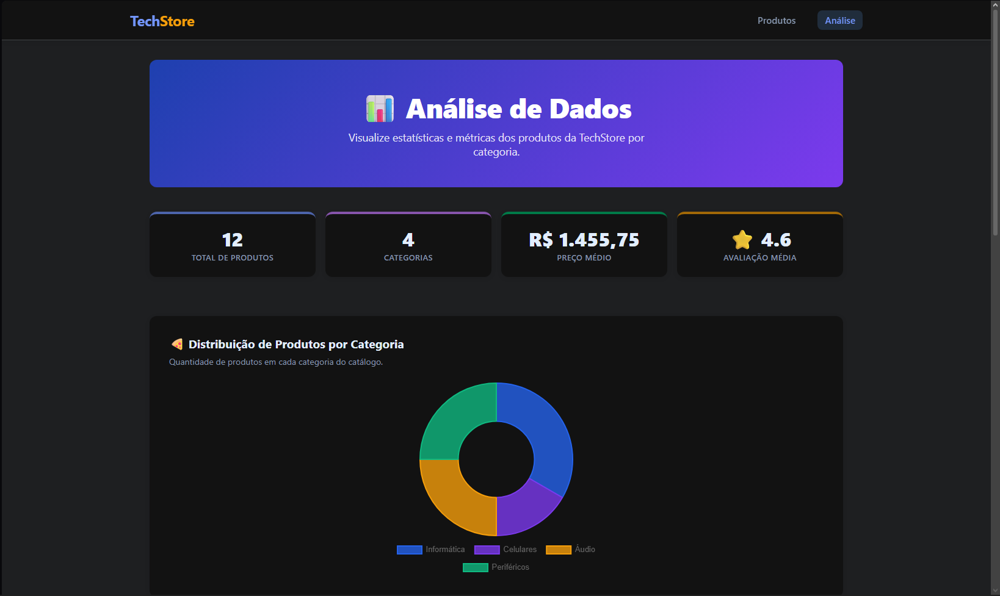
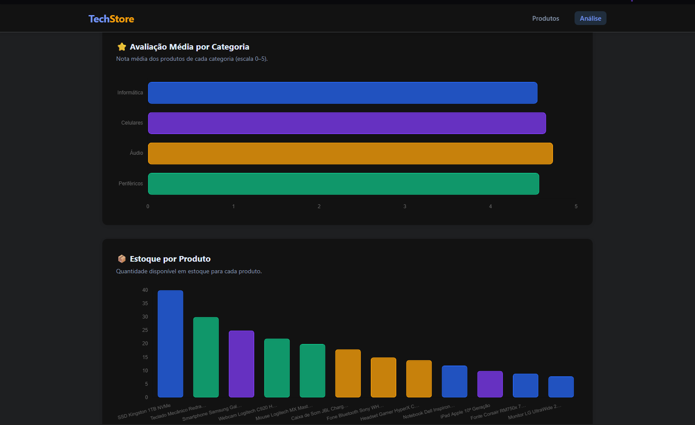

# Trabalho Prático - Semana 14

A partir dos dados que você tem no seu projeto, vamos trabalhar formas de apresentação que representem de forma clara e interativa essas informações. Você poderá usar gráficos (barra, linha, pizza), mapas, calendários ou outras formas de visualização. Seu desafio é entregar uma página Web que organize, processe e exiba os dados de forma compreensível e esteticamente agradável.

Com base nos tipos de projetos escohidos, você deve propor **visualizações que estimulem a interpretação, agrupamento e exibição criativa dos dados**, trabalhando tanto a lógica quanto o design da aplicação.

Sugerimos o uso das seguintes ferramentas acessíveis: [FullCalendar](https://fullcalendar.io/), [Chart.js](https://www.chartjs.org/), [Mapbox](https://docs.mapbox.com/api/), para citar algumas.

## Informações do trabalho

- Nome:  Matheus Possemato Lopes
- Matricula:  923502
- Proposta de projeto escolhida:  Catálogo de Produtos de Tecnologia (TechStore)
- Breve descrição sobre seu projeto:  Aplicação web de catálogo de produtos de tecnologia consumidos via API REST com JSON Server. A página inicial exibe produtos em cards com imagem, nome, categoria, preço e avaliação. Ao clicar, o usuário acessa detalhes completos do produto. Na Semana 14, foi adicionada uma página de análise de dados (charts.html) com gráficos interativos usando Chart.js, exibindo distribuição por categoria, preço médio, avaliação média e estoque por produto.

**Print da tela com a implementação**

<< Coloque aqui uma breve explicação da implementação feita nessa etapa>>

<<  COLOQUE A IMAGEM TELA 1 AQUI >> 

<<  COLOQUE A IMAGEM TELA 2 AQUI >> 
